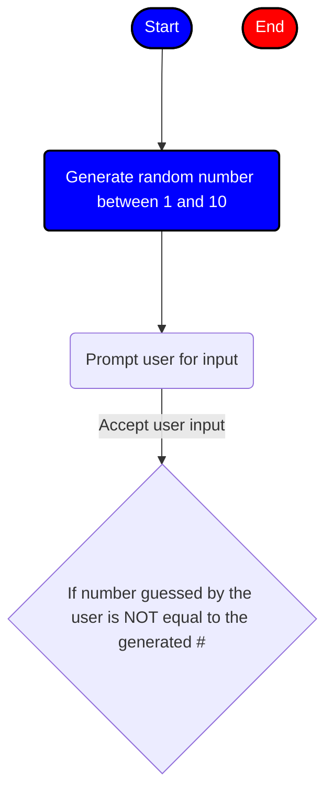

```mermaid
flowchart TD
Start([Start]):::blue
End([End]):::red
classDef blue fill:#0000FF, stroke: #000000, stroke-width: 2px, color: #FFF
classDef red fill:#FF0000, stroke: #000000, stroke-width: 2px, color: #FFF
    C("Generate random number between 1 and 10"):::blue
    Start ---> C
    D("Prompt user for input"):::black
    C ---> D
    E{"If number guessed by the user is NOT equal to the generated #"}
    D --Accept user input--> E
```
