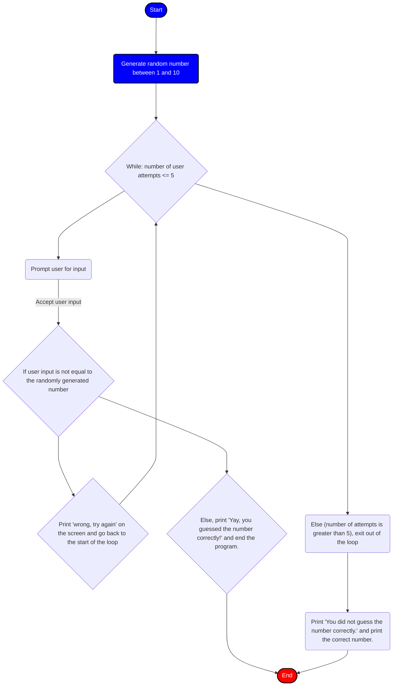

```mermaid
flowchart TD
Start([Start]):::blue
End([End]):::red
classDef blue fill:#0000FF, stroke: #000000, stroke-width: 2px, color: #FFF
classDef red fill:#FF0000, stroke: #000000, stroke-width: 2px, color: #FFF
    C("Generate random number between 1 and 10"):::blue
    Start ---> C
    D{"While: number of user attempts <= 5"}
    E("Prompt user for input"):::black
    C ---> D
    D ---> E
    F{"If user input is not equal to the randomly generated number"}
    G{"Print 'wrong, try again' on the screen and go back to the start of the loop"}
    E --Accept user input---> F
    F ---> G
    G ---> D
    X{"Else, print 'Yay, you guessed the number correctly!' and end the program."}
    F ---> X
    X ---> End
    Y("Else (number of attempts is greater than 5), exit out of the loop")
    D --> Y
    Z("Print 'You did not guess the number correctly.' and print the correct number.")
    Y --> Z
    Z --> End
```
